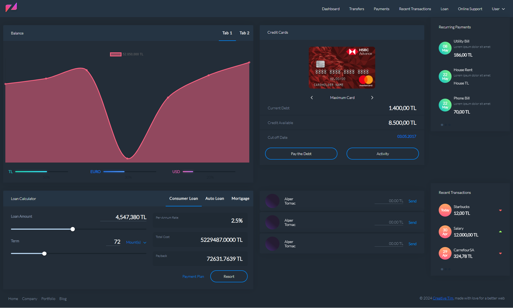

<h1 align="center">Banking System For FiveM using React and Lua</h1>

This repository is a banking system designed for FiveM, utilizing React and Lua. It includes several useful utilities. It supports both browser-based and in-game development workflows.

## Requirements

- [Node > v16](https://nodejs.org/en/)
- [Yarn](https://yarnpkg.com/getting-started/install) / [npm](https://docs.npmjs.com/cli/v10/commands/npm-install)

_A basic understanding of modern web development workflows. If you're unfamiliar with these, React might not be suitable for you at this stage._

## About The Project



Developed specifically for FiveM using React and Lua, this Banking System integrates essential financial management features such as a Loan Calculator, Recurring Payments, Recent Transactions, and Credit Card Management. The system also includes an interactive chart section, providing users with comprehensive visual analytics to enhance their financial tracking and decision-making within the FiveM environment.

### Built With

This project was built with the following technologies:

- [React](https://react.dev/)
- [Typescript](https://www.typescriptlang.org/)

## Getting Started

To get a local copy up and running follow these simple example steps.

### Installation

Please follow the following steps for successful installation:

1. **Clone the Repository:** Get started by cloning the repository to your local machine.

   ```
   https://github.com/Ruminatesoftware/bankingSystem.git
   ```

2. **Install Packages:** Navigate to the directory and install the required yarn packages by executing the following command in your terminal:

   ```sh
   yarn install
   ```

3. **Run the Project:** Finally, enter the following command in your terminal to start your server:

   ```sh
   yarn start
   ```

   Now, your application should be successfully up and running!

## Features

This setup includes some utilities and examples to use as a foundation.

1. **Loan Calculator:** Simple input fields for loan amount, interest rate, and duration, with real-time output for calculated results.

2. **Recurring Payments:** Users can add, edit, or delete recurring payments, view payment history, and receive notifications for due payments.

3. **Recent Transactions:** Interactive transaction list with options to view detailed transaction information and search functionality.

4. **Credit Card Management:** Users can view and manage their credit cards, monitor spending, and set up payment reminders.

5. **Chart Section:** Interactive charts with tooltips and filters, allowing users to customize the data range and categories displayed.

## Contributing

Contributions are what make the open source community such an amazing place to learn, inspire, and create. Any contributions you make are **greatly appreciated**.

If you have a suggestion that would make this better, please fork the repo and create a pull request. You can also simply open an issue with the tag &quot;enhancement&quot;.
Don&#39;t forget to give the project a star! Thanks again!

1. Fork the Project
2. Create your Feature Branch (`git checkout -b feature/AmazingFeature`)
3. Commit your Changes (`git commit -m &#39;Add some AmazingFeature&#39;`)
4. Push to the Branch (`git push origin feature/AmazingFeature`)
5. Open a Pull Request

## License

Distributed under the [MIT license](LICENSE).

## Contact

If you have any questions or suggestions, feel free to reach out to us:

- Raise an issue on the repository: [GitHub Repository](https://github.com/Ruminatesoftware?tab=repositories)

## Acknowledgments

A special thanks to the following for their contributions, support and inspiration:

- [Ruminate Software](https://ruminate.gohero.us/)
